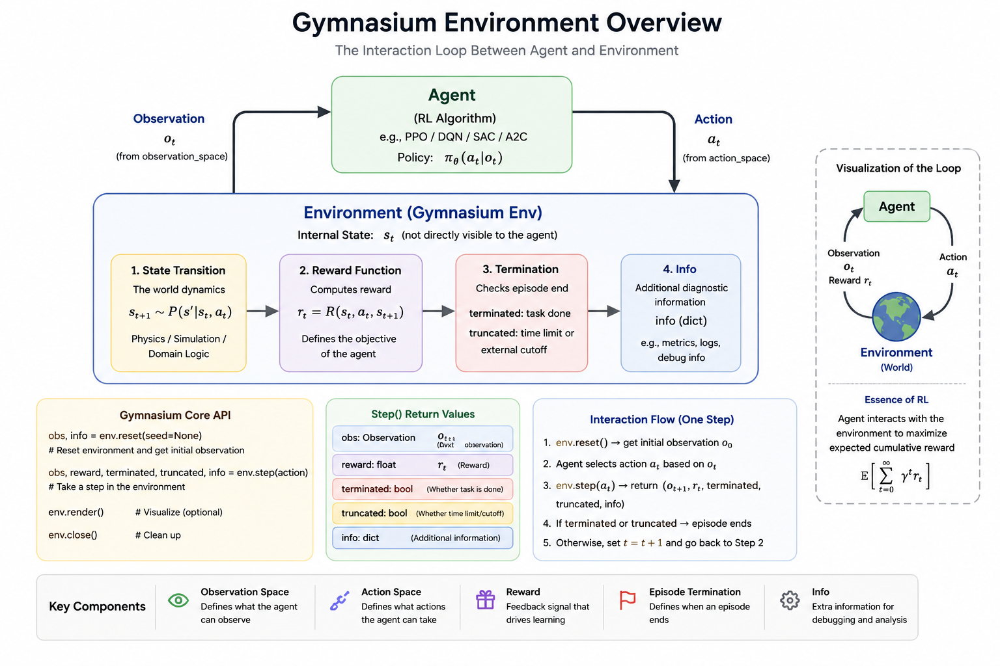
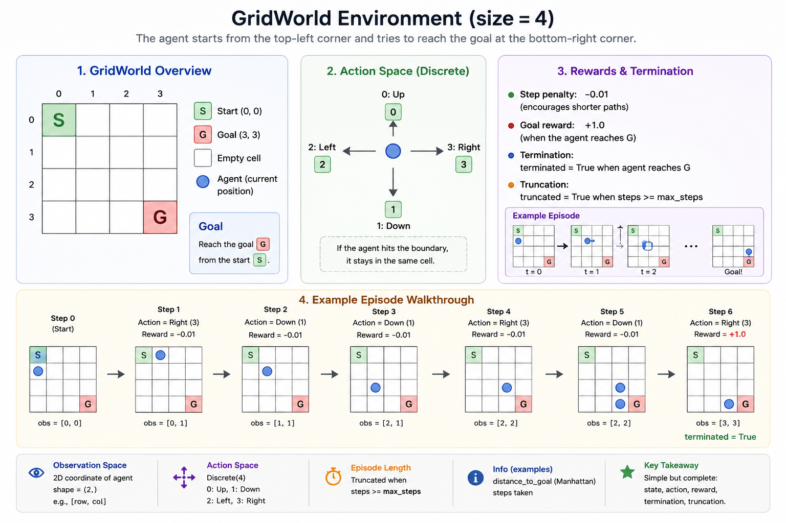

# RL Engineering in Practice: Building Reinforcement Learning Environments

> From Gymnasium APIs to Real Systems

<p align="center">
  
</p>

---

# Introduction

Most reinforcement learning tutorials start with:

```python
env = gym.make(...)
```

but very few explain:

- how RL environments are actually designed
- why reward engineering is difficult
- how observations affect training stability
- why agents exploit environment bugs

In practice, successful RL experiments depend not only on algorithms, but also on:

- environment engineering
- reward design
- debugging
- experimentation

This article focuses on the engineering side of reinforcement learning environments. We first discuss the core design decisions behind an environment, then build a minimal `GridWorld` environment with Gymnasium.

By the end, you should understand:

- what an RL environment is responsible for
- how observation spaces and action spaces affect learning
- why reward design is often the real bottleneck
- how to implement and debug a custom Gymnasium environment

The article is organized in two parts:

- Sections 1-5 explain the design principles behind RL environments.
- Section 6 turns those principles into a working `GridWorld` implementation.

---

# 1. What Is an RL Environment?

## 1.1 Agent and Environment

In reinforcement learning, the agent interacts with an environment through actions and observations.

At each timestep:

1. the agent receives an observation
2. the agent takes an action
3. the environment transitions to a new state
4. the environment returns a reward

The transition dynamics can be written as:

$$
s_{t+1} \sim P(s'|s_t, a_t)
$$

The environment defines:

- what the agent can observe
- what actions are allowed
- what rewards are given
- when episodes terminate

---

## 1.2 Why Environment Design Matters

A poorly designed environment can make even the best RL algorithm fail.

Environment design determines:


| Component         | Effect                         |
| ----------------- | ------------------------------ |
| Observation Space | What information the agent has |
| Action Space      | What behaviors are possible    |
| Reward Function   | What the agent optimizes       |
| Dynamics          | How difficult the task becomes |

In many practical systems:

> environment engineering matters more than algorithm choice.

---

# 2. Anatomy of a Gymnasium Environment

A Gymnasium environment typically looks like:

```python
class MyEnv(gym.Env):
```

Core components include:

- `observation_space`
- `action_space`
- `reset()`
- `step()`
- `render()`

These pieces form the contract between the learning algorithm and the world it is trying to solve.

---

## 2.1 Observation Space

The observation space defines the format, shape, and valid range of observations returned by the environment.

Example:

```python
self.observation_space = gym.spaces.Box(
    low=-1.0,
    high=1.0,
    shape=(4,),
    dtype=np.float32
)
```

The observation should:

- contain sufficient task information
- avoid future information leakage
- remain numerically stable
- have normalized scales when possible

---

## 2.2 Action Space

The action space defines what actions the agent can take.

Discrete actions:

```python
gym.spaces.Discrete(4)
```

Continuous actions:

```python
gym.spaces.Box(low=-1, high=1, shape=(2,))
```

Action design strongly affects:

- exploration difficulty
- training stability
- robotics controllability

---

## 2.3 reset()

`reset()` initializes a new episode and returns the first observation.

```python
obs, info = env.reset()
```

Key considerations:

- initial state distribution
- randomness
- curriculum learning
- reproducibility

Poor reset logic often causes unstable training because the agent may experience inconsistent starting states.

---

## 2.4 step(action)

`step(action)` is the core environment transition function.

```python
obs, reward, terminated, truncated, info = env.step(action)
```

Responsibilities include:

- state transition
- reward computation
- termination checking
- logging/debug information

This function effectively defines the task dynamics.

---

# 3. Designing Observation Spaces

## 3.1 What Should Be Observed?

The observation is the information available to the agent when it chooses an action.

A good observation should:

- contain enough information for decision making
- avoid unnecessary noise
- remain consistent across timesteps
- match what would be available in the real task

Examples:

- robot joint states
- velocities
- target positions
- sensor readings

---

## 3.2 Common Mistakes

### Future Information Leakage

The observation accidentally contains information unavailable in reality.

Example: giving the agent the exact future target position when the real robot would only receive noisy sensor readings.

### Inconsistent Scaling

Some values are extremely large while others are tiny.

Example: mixing joint angles in radians, pixel coordinates, and raw force values without normalization.

### Missing Critical States

The agent cannot infer necessary task information.

Example: giving position but not velocity in a task where momentum matters.

### Partial Observability

The environment hides important states.

Sometimes partial observability is intentional, but then the policy may need memory, frame stacking, or recurrent networks.

---

## 3.3 Observation Normalization

Normalization improves:

- gradient stability
- learning speed
- optimization consistency

Common approaches:

- mean/std normalization
- clipping
- running statistics

---

# 4. Designing Action Spaces

## 4.1 Discrete vs Continuous Actions


| Type       | Example              |
| ---------- | -------------------- |
| Discrete   | move left/right      |
| Continuous | robot torque control |

Discrete action spaces are easier to debug because every action has a clear meaning. Continuous action spaces are more expressive, but they usually make exploration and stabilization harder.

---

## 4.2 Robotics Action Design

Common robotics action spaces include:

- torque control
- velocity control
- position control

Each introduces different stability and safety constraints.

As a rule of thumb:

- torque control gives more direct physical control but can be unstable
- velocity control is often easier to learn
- position control is safer and more structured but may limit behavior

---

## 4.3 Action Clipping

Example:

```python
action = np.clip(action, -1.0, 1.0)
```

Important for:

- physical validity
- numerical stability
- avoiding simulator explosions

---

# 5. Reward Engineering

Reward engineering is one of the hardest parts of RL because the agent optimizes exactly what the reward says, not what the designer intended.

---

## 5.1 Sparse vs Dense Rewards

Sparse reward:

```python
reward = 1 if success else 0
```

Dense reward:

```python
reward = -distance_to_target
```

Trade-off:


| Sparse            | Dense             |
| ----------------- | ----------------- |
| hard exploration  | easier learning   |
| cleaner objective | risk of shortcuts |

Sparse rewards are closer to the real task objective, but they can make exploration extremely difficult. Dense rewards provide more learning signal, but they can accidentally teach the wrong behavior.

---

## 5.2 Reward Shaping

Potential-based shaping:

$$
F(s,a,s') = \gamma \Phi(s') - \Phi(s)
$$

Reward shaping can accelerate learning, but it may introduce unintended behaviors if the shaped reward becomes easier to optimize than the actual task.

---

## 5.3 Reward Hacking

Agents often exploit loopholes in reward functions.

Examples:

- spinning in circles
- exploiting simulator bugs
- farming unintended rewards

A rising reward curve does not always mean meaningful behavior.

For this reason, always inspect behavior visually when possible.

---

## 5.4 Reward Scaling

Improper reward scales may cause:

- exploding Q-values
- unstable gradients
- learning collapse

Reward normalization is often necessary.

Good reward scales are usually boring: large enough to create a learning signal, but not so large that value estimates become unstable.

---

# 6. Building a Minimal Custom Environment: GridWorld

To make the environment design concrete, we will build a small `GridWorld` environment.

The task is simple:

> The agent starts from the top-left corner and tries to reach the goal at the bottom-right corner.

This example is intentionally small. The goal is not to create a difficult benchmark, but to expose every important part of an RL environment in a form that is easy to inspect.

<p align="center">
  
</p>

---

## 6.1 Task Definition

We define a small grid world:

```text
S . . .
. . . .
. . . .
. . . G
```

Where:

- `S` is the start position
- `G` is the goal position
- the agent can move up, down, left, or right
- each step receives a small negative reward
- reaching the goal gives a positive reward

This environment contains all key components of an RL task:


| Component   | Design                     |
| ----------- | -------------------------- |
| Observation | Agent position             |
| Action      | Move up/down/left/right    |
| Reward      | Step penalty + goal reward |
| Termination | Agent reaches goal         |
| Truncation  | Maximum episode length     |

---

## 6.2 Environment Code

The full environment is shown below. Notice that most of the work happens inside `reset()` and `step()`.

```python
import gymnasium as gym
from gymnasium import spaces
import numpy as np


class GridWorldEnv(gym.Env):
    """
    A simple GridWorld environment.

    The agent starts at (0, 0) and needs to reach the goal at
    (size - 1, size - 1).
    """

    metadata = {"render_modes": ["human", "ansi"]}

    def __init__(self, size=4, max_steps=50, render_mode=None):
        super().__init__()

        self.size = size
        self.max_steps = max_steps
        self.render_mode = render_mode

        # Actions:
        # 0 = up
        # 1 = down
        # 2 = left
        # 3 = right
        self.action_space = spaces.Discrete(4)

        # Observation:
        # agent position represented as [row, col]
        self.observation_space = spaces.Box(
            low=0,
            high=size - 1,
            shape=(2,),
            dtype=np.int32,
        )

        self.agent_pos = None
        self.goal_pos = np.array([size - 1, size - 1], dtype=np.int32)
        self.steps = 0

    def reset(self, seed=None, options=None):
        super().reset(seed=seed)

        self.agent_pos = np.array([0, 0], dtype=np.int32)
        self.steps = 0

        observation = self._get_obs()
        info = self._get_info()

        return observation, info

    def step(self, action):
        self.steps += 1

        # Convert action into movement
        if action == 0:      # up
            move = np.array([-1, 0])
        elif action == 1:    # down
            move = np.array([1, 0])
        elif action == 2:    # left
            move = np.array([0, -1])
        elif action == 3:    # right
            move = np.array([0, 1])
        else:
            raise ValueError(f"Invalid action: {action}")

        # Update position and keep it inside the grid
        self.agent_pos = np.clip(
            self.agent_pos + move,
            0,
            self.size - 1,
        )

        # Check termination
        terminated = np.array_equal(self.agent_pos, self.goal_pos)

        # Check truncation
        truncated = self.steps >= self.max_steps

        # Reward design
        if terminated:
            reward = 1.0
        else:
            reward = -0.01

        observation = self._get_obs()
        info = self._get_info()

        return observation, reward, terminated, truncated, info

    def render(self):
        grid = np.full((self.size, self.size), ".", dtype=str)

        grid[tuple(self.goal_pos)] = "G"
        grid[tuple(self.agent_pos)] = "A"

        output = "\n".join(" ".join(row) for row in grid)

        if self.render_mode == "human":
            print(output)
            print()
        elif self.render_mode == "ansi":
            return output
        else:
            return output

    def _get_obs(self):
        return self.agent_pos.copy()

    def _get_info(self):
        return {
            "distance_to_goal": np.linalg.norm(
                self.agent_pos - self.goal_pos,
                ord=1,
            ),
            "steps": self.steps,
        }
```

---

## 6.3 Running the Environment

Before connecting any learning algorithm, run the environment manually or with random actions.

```python
env = GridWorldEnv(size=4, max_steps=20, render_mode="human")

obs, info = env.reset(seed=42)

print("Initial observation:", obs)
print("Initial info:", info)

terminated = False
truncated = False

while not terminated and not truncated:
    action = env.action_space.sample()

    obs, reward, terminated, truncated, info = env.step(action)

    env.render()

    print("Action:", action)
    print("Observation:", obs)
    print("Reward:", reward)
    print("Terminated:", terminated)
    print("Truncated:", truncated)
    print("Info:", info)
    print("-" * 30)
```

---

## 6.4 Understanding the Design

### Observation

The observation is simply the agent position:

```python
[row, col]
```

For example:

```python
np.array([0, 0])
```

This is enough because the goal is fixed at the bottom-right corner. If the goal were randomized, the goal position should also be included in the observation.

In more complex environments, observations may include:

- robot joint positions
- velocities
- camera images
- lidar readings
- target positions

---

### Action Space

The action space is discrete:

```python
spaces.Discrete(4)
```

The four actions are:


| Action | Meaning |
| ------ | ------- |
| `0`    | Up      |
| `1`    | Down    |
| `2`    | Left    |
| `3`    | Right   |

This is simple and easy to debug.

For robotics tasks, the action space is often continuous:

```python
spaces.Box(low=-1.0, high=1.0, shape=(n,))
```

where each dimension may represent torque, velocity, or position commands.

---

### Reward Function

The reward is:

```python
reward = 1.0 if goal_reached else -0.01
```

This means:

- the agent is encouraged to reach the goal
- the agent is slightly penalized for taking too many steps

This small step penalty encourages shorter paths.

However, reward design is a trade-off:


| Reward Choice                    | Effect                            |
| -------------------------------- | --------------------------------- |
| `+1` at goal only                | Sparse reward, harder exploration |
| `-distance_to_goal`              | Dense reward, easier learning     |
| `-0.01` per step                 | Encourages efficiency             |
| Large negative collision penalty | Encourages safety                 |

---

### Terminated vs Truncated

Gymnasium separates episode ending into two concepts:

```python
terminated
truncated
```

`terminated=True` means the task naturally ended.

Example:

```python
agent reached the goal
```

`truncated=True` means the episode was externally cut off.

Example:

```python
maximum step limit reached
```

This distinction is important for correct RL training.

If an episode ends because the task is solved, use `terminated=True`. If it ends because a time limit is reached, use `truncated=True`.

---

## 6.5 Debugging the Environment

Before training any RL algorithm, test the environment with a random policy.

```python
env = GridWorldEnv(size=4, max_steps=20)

obs, info = env.reset()

for _ in range(10):
    action = env.action_space.sample()
    obs, reward, terminated, truncated, info = env.step(action)

    print({
        "obs": obs,
        "reward": reward,
        "terminated": terminated,
        "truncated": truncated,
        "info": info,
    })

    if terminated or truncated:
        obs, info = env.reset()
```

Check:

- Does the agent stay inside the grid?
- Does the reward look reasonable?
- Does the episode terminate at the goal?
- Does truncation happen after `max_steps`?
- Does `info` contain useful debugging information?

This step is small but important. If the random policy exposes bugs, a trained policy will usually exploit them even faster.

---

## 6.6 Environment Design Lessons

This GridWorld example demonstrates the core idea of RL environment engineering:

> An environment is not just a Python class.
> It defines the world, the task, the feedback signal, and the failure modes.

Even in this simple example, design decisions matter:

- Should the observation include only agent position?
- Should the goal position be included?
- Should the reward be sparse or dense?
- Should invalid moves be penalized?
- Should the initial position be fixed or randomized?

These choices directly affect learning difficulty.

A good environment should make these choices explicit instead of hiding them inside implementation details.

---

## 6.7 Possible Extensions

This environment can be extended in many ways:

### Random Start and Goal

```python
self.agent_pos = self.np_random.integers(
    low=0,
    high=self.size,
    size=(2,),
    dtype=np.int32,
)
```

### Obstacles

Add blocked cells that the agent cannot enter.

```text
S . X .
. . X .
. . . .
X . . G
```

### Dense Reward

Use distance-based reward:

```python
reward = -np.linalg.norm(self.agent_pos - self.goal_pos, ord=1)
```

### Partial Observability

Only show the local neighborhood around the agent.

### Stochastic Dynamics

Make actions sometimes fail:

```python
if self.np_random.random() < 0.1:
    action = self.action_space.sample()
```

These extensions make the environment closer to real-world RL problems.

When extending an environment, add one source of complexity at a time. This makes it much easier to identify which design change caused a training problem.

---

## 6.8 Environment Registration

For larger projects, it is useful to register the custom environment so it can be created with `gym.make()`.

Example:

```python
gym.register(
    id="CustomGridWorld-v0",
    entry_point="envs.gridworld:GridWorldEnv",
)
```

Then the environment can be created like this:

```python
env = gym.make("CustomGridWorld-v0")
```

Registration is helpful when:

- environments are reused across experiments
- training scripts should not import environment classes directly
- multiple environment variants need consistent names
- benchmark results should be easier to reproduce

---

## 6.9 A Practical Project Layout

As the environment grows, avoid keeping everything in one script. A cleaner structure is:

```text
rl_project/
|-- envs/
|   |-- __init__.py
|   `-- gridworld.py
|-- train.py
|-- evaluate.py
`-- configs/
    `-- gridworld.yaml
```

This separation makes it easier to:

- test the environment independently
- reuse the same environment across algorithms
- keep training code separate from environment logic
- add configuration files for different experiments

---

# Conclusion

Reinforcement learning engineering is not only about algorithms. A well-designed environment is part of the learning system.

The main lessons from this article are:

- observations define what the agent can know
- actions define what the agent can do
- rewards define what the agent will optimize
- termination and truncation define how episodes end
- debugging should happen before training begins

In practice, a strong RL algorithm cannot compensate for a broken task definition, misleading reward, unstable observation, or invalid action interface.

The best way to build environments is to treat them as experimental systems:

- define the task clearly
- make the state and action spaces explicit
- test the environment before training
- inspect behavior, not only reward
- add complexity gradually

---

# Appendix A: Gymnasium API Cheatsheet


| API                 | Purpose                |
| ------------------- | ---------------------- |
| `reset()`           | initialize episode     |
| `step()`            | environment transition |
| `render()`          | visualization          |
| `observation_space` | observation definition |
| `action_space`      | action definition      |
| `terminated`        | natural task ending    |
| `truncated`         | external time cutoff   |

---

# Appendix B: Further Reading

- Gymnasium documentation: https://gymnasium.farama.org/
- Stable-Baselines3 documentation: https://stable-baselines3.readthedocs.io/
- MuJoCo documentation: https://mujoco.readthedocs.io/
- Isaac Lab documentation: https://isaac-sim.github.io/IsaacLab/
